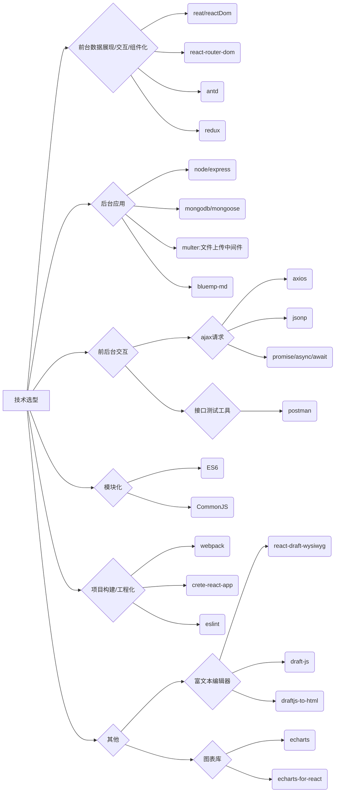

# 移动 App 第一天

## 1.什么是混合移动 App 开发 【重点】

1. 苹果上的软件是如何开发出来的: 使用的是 OC、或者 Swift 这门语言
2. 安卓平台上的软件又是如何开发出来的: 使用 Android 相关的语言开发的,Java,安卓的控件来进行开发
3. 苹果和安卓平台上的软件是如何开发出来的: xx 招两套开发人员[开发组]
4. 前端移动 App(Application)开发技术,去开发手机端的应用程序
5. 前端的混合移动 App 开发技术,并没有使用苹果或安卓官方推荐的开发平台和开发方式,而是抛弃了官方提供的方式,使用前端特有的技术,进行移动 App 开发体验!

> 什么是移动 App 开发: 通俗理解,就是把开发 Web 网站的技术(HTML+CSS+JS),通过某种方式,移植到 App 开发商进行使用,这种利用 Web 开发进行移动端开发体验的方式,叫做混合移动 App 开发!

### 1.1 关于移动 App 开发,需要知道的几个概念

- 原生开发: NativeApp, 指的就是使用 IOS、Android 官方提供的工具、开发平台、配套语言 进行手机 App 开发的方式。
- 混合开发: HybirdApp, 使用前端已有的技术(HTML + CSS + JS),搭配一些相关的打包编译技术,开发出一个手机 App,安装到手机钟进行使用。
- 什么是 App: Application 的缩写,可安装的应用程序.
- App 的分类:
  - 按照平台划分:
    - PC 端: 浏览器、代码编辑器(VS Code)、PC 端的游戏、音乐播放器、视频播放器...
    - 移动端: 聊天工具、视频工具、手游...
  - 按照功能来划分:
    - 游戏: 愤怒的小鸟、植物大战僵尸...
    - 应用: 非游戏类的 App(支付宝...)
- App 和 Web 的区别:
  - App 概念: Application 的缩写,可安装的应用程序.
    - 优点: 流畅、稳定、某些 App 可用脱网运行,用户体验好
    - 缺点: 不能跨平台
  - Web 概念: 特指那些基于浏览器的 Web 网站(本质: 就是网页)
    - 优点: 可用跨平台(天生)
    - 缺点: 没有 App 流畅、不稳定,受限于网速和网络

## 2.为什么要学混合 App 开发

### 2.1 从程序员的角度分析

1. 扩展自己能做的事
2. 能够接触到前端流行的技术和框架(在 React 中,全部都使用 ES6 语法)

- 前端的发展: `只能做页面` -> `Ajax前后数据交互` -> `Jquery Bootstrap` -> `Web App`(网站端的开发,网站功能很复杂,与真正 App 功能基本无异) -> `三大框架`(Angular,React,Vue) -> `可用做手机混合App/桌面应用` -> `手机原生App` -> 大胆猜测`发射火箭,发射卫星,发射导弹!!!` -> `统一全宇宙....`

### 2.2 从企业的角度分析: (选择合适自身的移动 App 开发方式) 【重点】

- 节省开发成本
  - 从工资上: 尽最大的可能,压榨员工的剩余劳动力
  - 从时间上: 原生的 Android 和 IOS 开发,开发效率并不事很高.原生的代码迭代比较多,比较复杂!开发周期比较久;如果采用移动 Web 开发,开发周期会很短(HTML + CSS + JS)足够简单.
- 市面上常见的 App 开发方式
  - WebApp: 基于浏览器实现的,有特定功能的网站,称作 WebApp
    - 例如: 百度脑图、淘宝移动端...
    - 优点: 跨平台
    - 缺点: 依赖网络,有白屏效果,用户体验差;没有提供硬件底层设备
  - NativeApp: 用 android 和 Object-C 等原生语言开发的应用
    - 优点: 体验好;用户使用起来很流畅;非常适合做游戏【性能高】;可以直接调用底层硬件 API;
    - 缺点: 不能跨平台
  - HybirdApp: 利用前端所学的知识去开发移动端 App,兼具 2 者的优势
    - 优点: 能够跨平台;体验会更好一些;能够调用硬件底层的 API
    - 缺点: 相对于原生体验稍微弱一丢丢;不适合做游戏;适合做非游戏类型的手机 App
  - 注意: 在 Java 或者 IOS 写出来的代码和程序,在最终运行的适合,普通的文本代码,会被编译为原生的机器码去执行,并不像 JS(解析执行),Java 代码是编译运行的;

## 3.企业中项目开发流程

- 需求调研: 产品定位、受众群体、市场需求、开发价值;【产出物: 需求文档】
- 产品设计: 功能模块、流程逻辑;【产出物: 设计文档,交互稿】, 确定项目的基本功能;
- 项目开发: 项目架构、美工、后台、测试【产品的把控】 **要理解前后端分离的概念**
- 运营维护: 上线运行、调 Bug、微调功能模块、产品迭代

> 根据需求搞设计,根据设计做开发

## 4.企业技术选型 - 几大主流技术之间的关系

1. Angular.js 和 Ionic

- [Angular1 官网](https://angularjs.org/)
- [Angular2 官网](https://angular.io/)
- [Icon 中文网](http://www.ionic.wang/)
- [Icon 英文网](http://ionicframework.com/getting-started)

2. Vue.js 和 Weex

- [Vue.js 官网](https://cn.vuejs.org)
- [Weex 文档](http://weex.apache.org/cn/references/index.html)
- [Weex - github 地址 - 新](https://github.com/apache/incubator-weex)
- [Weex - github 地址 - 旧](https://github.com/alibaba/weex)

3. React.js 和 React-Native

- [React.js 英文官网](https://facebook.github.io/react)
- [ReactNative 中文网](http://reactnative.cn)
- [ReactNative 英文网](http://facebook.github.io/react-native)

> Angular,Vue,React 这三个都是前端框架,我们进行混合 App 开发的时候,这是用到了这三个框架的基础语法而已
> Ionic,Weex,ReactNative 这三个都是打包工具(提供了相关的命令行,只要指定的命令,就能把项目打包成一个手机 App 出来),能够把我们开发出来的应用,最终打包成一个可安装在手机端程序安装包;同时,这三个东西,也提供了好用的一些小组件

## 5.前端混合 App 开发框架

1. Html5+、ReactNative、Weex、Ionic
2. [认识 HTML5+](http://www.html5plus.org/#home)
   - h5+是一个产业联盟,它有一些互联网成员,专门在中国推广 H5
3. [HBuilder 官网](http://www.dcloud.io)

## 6.开发框架之间的区别

1. Html5+ 和 Ionic
   - 要先做出来一个完整的网站,然后,在网站的基础上,使用 H5+ 或 Ionic 提供的打包技术,把网站打包成一个应用
   - 为什么要打包:
     1. 为了安装到手机上
     2. 为了调用底层 API
   - 打包好之后,就得到一个 apk 包(安卓应用),这个应用的内部运行的
   - [优点] : 开发效率高;
   - [缺点] : 内部本质上是一个网站,运行效率和性能不太好
2. ReactNative 和 Weex
   - 首先需要开发出一个完整的项目(不是一个网站,而是一个模板项目),<font color=red>既不能在网页中运行,也不能在移动端中运行</font>
   - 通过 RN 或 Weex 提供的打包命令行指令,将模板代码翻译成移动端的 Java 或 OC 代码;最终得到一个原生的 App 项目.
   - [优点] : 使用前端技术开发(开发成本更低),开发出来的应用性能好,更流畅.
   - [缺点] : 暂时,可用使用的组件比较少

## 环境变量的作用

将需要全局使用的工具或者应用程序,配置到 Path 环境变量中,可以很方便的通过命令行的形式,在任何想要运行这些应用程序的地方,运行它们

# 移动 App 第二天

## 1.ReactNative 快速使用

### 1.1 ReactNative 的安装

1. 安装完[node](https://nodejs.org/en/)后,建议设置 npm 镜像以加速后面的过程(或使用科学上网工具)。注意:**不要使用 cnpm!** cnpm 安装的模块路径比较奇怪,package 不能正常识别!

   > npm config set registry https://registry.npm.taobao.org --global
   > npm config set disturl https://npm.taobao.org/dist -- global

2. Yarn、React Native 的命令行工具(react-native-cli)

- Yarn 是 FaceBook 提供的代替 npm 的工具,可以加速 node 模块的下载。React Native 的命令行工具用于创建、初始化、更新项目、运行打包服务等任务。

> npm install -g yarn react-native-cli

- 安装完 yarn 后同理也要设置镜像源:
  > yarn config set registry https://registry.npm.taobao.org --global
  > yarn config set disturl https://npm.taobao.org/dist --global

3. 运行 `react-native init AwesomeProject` 创建 React-Native 项目
4. 运行 `cd AwesomeProject` 切换到项目根目录中, 运行 `adb devices`来确保有设备连接到了电脑上
5. 运行 `react-native run-android`打包编译安卓项目,并部署到模拟器或开发机中
6. 运行上一条命令之间,要确保有设备连接到了电脑上,可以运行`adb devices`查看当前介入的设备列表,打包好的文件,放到了 `android\app\build\outputs\apk` 目录下

## 2. Webpack 的准备

- 在学 React-Native 之前,必须有 React 作为前驱学科.(RN 几乎都是使用的 react 语法进行开发的)
- 学 React 之前,先需要了解 Webpack(node 编写),因为它相当于将 React 的语法,通过 Webpack 和 React 语法转换成最终的 html + css + javascript
- 学习 Webpack 更深层次的理由是,可以使用 Webpack 来极大的提高开发效率(如使用 ES6 进行开发)
- 所以下面的学习路径是 Webpack(深度学习) -> React -> React Native

### 2.1 Webpack 发布的策略

1. 在实际开发中,一般会有两套方案:
   - 开发期间的项目:包含了测试文件、测试数据、开发工具、测试工具等相关配置,有利于项目的开发和测试,但是这些文件仅用于开发,发布项目的时候需要删除
   - 部署期间的项目,剔除了那些客户用不到的测试数据、测试工具和文件,比较纯净,减少了项目发布后的体积,有利于开发和部署
2. 为了满足我们的发布策略,需要新建一个配置文件,命名为`webpack.publish.config.js`,将`webpack.config.js`的配置拷贝过去,剔除一些开发配置项即可.
   - 将`devSever`节点删掉:
   ```
   devServer: {
     hot: true,
     open: true,
     port: 4321
   }
   ```
   - 将`plugins`节点下的热更新插件删掉:
   ```
   new webpack.HotModuleRupluComuntPlugin()
   ```

## 3. Webpack 从 0 开始使用

### 3.1 项目初始化

<font color=red>注</font>: node 当前的版本是 12.10.0

1. 新建项目(文件夹)`webpack-senior`
2. 进入`webpack-senior`新建下面三个:
   - 打包之后的文件夹: `dist`
   - 项目的源代码: `src`
   - webpack 的配置文件: `webpack.config.js`
3. 初始化项目: `npm init -y`
   - 使用 yarn 安装 jquery: `yarn add jquery` (等同于 npm i -D jquery)
4. src 的初始化,在其中新建如下文件和内容:
   - `src/index.js`
   ```html
   <html>
     <body>
       <ul>
         <li>这是第1个li</li>
         <li>这是第2个li</li>
         <li>这是第3个li</li>
         <li>这是第4个li</li>
       </ul>
     </body>
   </html>
   ```
   - `src/main.js`
   ```javascript
   import $ from 'jquery'
   $(function() {
     $('li:odd').css('backgroundColor', 'pink')
     $('li:even').css('backgroundColor', 'marron')
   })()
   ```
5. 上面完成了简单的页面和 js 对页面的操作,下面写 Webpack 的配置文件(webpack 使用配置文件对项目进行打包构建)

   - `webpack.config.js`

   ```js
   const path = require('path')

   module.exports = {
     entry: path.join(__dirname, './src/main.js'),
     output: {
       path: path.join(__dirname, './dist'),
       filename: 'bundle.js'
     }
   }
   ```

   - 以上代码指明了 webpack 的入口和打包文件,下面需要装 2 个插件来使 index.html 和 main.js 在内存中生成:

   1. `yarn add webpack --dev`(webpack 是在开发环境中进行的,因此需要在 npm 中使用-S,在 yarn 中则变为 --dev)
   2. `yarn add webpack-dev-server html-webpack-plugin --dev`: 安装在内存中生成 index.html 和 main.js 的插件,改写`webpack.config.js`如下:

   ```js
   const path = require('path')
   const htmlWebpackPlugin = require('html-webpack-plugin')

   module.exports = {
     entry: path.join(__dirname, './src/main.js'),
     output: {
       path: path.join(__dirname, './dist'),
       filename: 'bundle.js'
     },
     plugin: [
       new htmlWebpackPlugin({
         template: path.join(__dirname, './src/index.html'),
         filename: 'index.html'
       })
     ]
   }
   ```

   - 上面已经将 html 页面放到了内存中,接下来配置启动命令:`package.json`

   ```json
   {
     "scripts": {
       "dev": "webpack-dev-server --open --port 3000 hot"
     }
   }
   ```

6. 小检测点:对上面过程进行说明

- 从启动命令`npm run dev`说起
  - 当在命令行,输入 `npm run dev`时
  - 工具: `webpack-cli`(安装在开发环境, yarn add webpack-cli --dev),会以命令行启动的目录作为当前目录,去寻找`package.json`文件
  - 找到`package.json`文件后,会寻找`"scripts"`
  - 找到`scripts`对象后,进而找到"dev"
  - 然后运行命令`webpack-dev-server --open --port 3000 --hot`
  - `webpack-dev-server`:
  1. 每次写完代码手动调用 webpack 去打包代码太麻烦,因此使用 webpack-dev-server 来进行自动打包构建
  2. 会根据`package.json`中 output 的配置,生产一个内存中的`main.js`文件.

### 3.2 webpack 中 loader 的配置

webpack 默认只能解析`.js`和`.json`文件,若想解析其他类型的文件,需要配置 loader

#### 3.2.1 配置 loader 解析`.scss`

1. 在 src 目录下新建目录结构`/src/css/index.scss`
2. 在`index.scss`中写入如下:

```scss
html,
body {
  margin: 0;
  padding: 0;

  ul {
    list-style: none;
    padding: 0;
    margin: 0;
  }

  li {
    font-size: 12px;
    line-height: 30px;
    padding-left: 10px;
  }

  .box {
    width: 500px;
    height: 230px;
    background: url('../images/开心.gif');
    background-size: cover;
  }
}
```

3. 在`/src/index.html`中添加如下:

```html
<div class="box"></div>
```

4. 在 main.js 中导入`index.scss`:

```javascript
import './css/index.scss'
```

此时项目肯定启动不了,因为未配置 loader 的 webpack 不能解析`.scss`,下配置:

- 解析 CSS、SCSS、URL 加载
  - 安装依赖: `yarn add style-loader css-loader sass-loader node-sass url-loader file-loader --dev`

```js
// webpack.config.js
module.exports = {
  module: {
    rules: [
      { test: /\.css$/, use: ['style-loader', 'css-loader'] },
      { test: /\.scss$/, use: ['style-loader', 'css-loader', 'sass-loader'] },
      { test: /\.(png|gif|bump|jpg)$/, use: ['url-loader?limit=5000'] }
    ]
  }
}
```

- 解析 ES6 的高级语法
  - 安装依赖: `yarn add babel-core babel-loader babel-plugin-transform-runtime babel-preset-env babel-preset-stage-0 --dev`
  ```javascript
  // webpack.config.js
  module.exports = {
    module: {
      rules: [{ test: /\.js$/, use: 'babel-loader', exclude: /node_modules/ }]
    }
  }
  ```
  ```js
  //  .babelrc
  {
    "presets": ["env", "stage-0"],
    "plugins": ["transform-runtime"]
  }
  ```
  - `Error: Cannot find module '@babel/core'`: 查看报错,是因为`babel-loader`的版本过高,根据提示输入`yarn add babel-loader@7 --dev`即可
  - `Module not found: Error: Can't resolve 'scss-loader' in 'D:\L-rn\HeiMa\webpack-senior'`:没有找到`scss-loader`模块,打开 package.json 可以看到,里面有一个'sass-loader',将`webpack.config.js`中的 scss 改为 sass 即可.

## 4. 使用 Webpack 打包项目

现在假设项目已经开发完毕,并且打算使用 webpack 将项目进行打包.

### 4.1 直接在命令行输入`webpack`命令进行打包

- 直接打包,生成的项目体积会很大,许多不需要的内容都会被打包在里面

### 4.2 优化打包

- 1.新建一个打包时的 webpack 配置文件: `webpack.pub.config.js`
- 2.新建一个打包指令:`package.json`

```json
{
  "scripts": {
    "build": "webpack --config webpack.pub.config.js"
  }
}
```

- 3.将打包后的所有图片放到`dist/images`中统一管理
  - 改变`webpack.pub.config.js`

```javascript
module.exports = {
  module: {
    rules: [
      {
        test: /\.(png|gif|bump|jpg)$/,
        use: ['url-loader?limit=5000&name=images/[hash:8]-[name].[ext]']
      }
    ]
  }
}
```

- 4.每次打包都删除之前的 dist 文件

  - 安装插件 `yarn add clean-webpack-plugin --dev`
  - 配置: `webpack.pub.config.js`

  ```javascript
  const { CleanWebpackPlugin } = require('clean-webpack-plugin')
  module.exports = {
    plugins: [new CleanWebpackPlugin()]
  }
  ```

  - <font color=red>TypeError: cleanWebpackPlugin is not a constructor</font> : 规则配置的时候出错,不需要传入参数下面是官网原话,拿出组件时,用到了结构赋值.
    > By default, this plugin will remove all files inside webpack`s output.path directory,as well as all unused webpack assets after every successful rebuild

- 5.将自己的代码和第三方包分离

  - `webpack.pub.config.js`

  ```javascript
  const webpack = require('webpack')
  const WebpackPlugin = new webpack.optimize.CommonsChunkPlugin({
    name: 'common',
    filename: 'common.js'
  })
  module.exports = {
    entry: {
      app: path.join(__dirname, './src/main.js'),
      common: ['jquery']
    },
    plugins: [WebpackPlugin]
  }
  ```

  - 自动优先加载第三方模块,在加载自己的代码.
    &nbsp;

- 6.将所有 js 文件放到 js 文件夹下面
  - webpack.pub.config.js
  ```git
  const WebpackPlugin = new webpack.optimize.CommonsChunkPlugin({
    name: 'common',
  -  filename: 'common.js'
  +  filename: 'js/common.js'
  });
  module.exports = {
    output: {
  -    filename:'[name].js'
  +    filename:'js/[name].js'
    }
  }
  ```
- 7.压缩 js 代码

  ```js
  // 压缩JS代码
  const UglifyJsPlugin = new webpack.optimize.UgliJsPlugin({
    compress: {
      warnings: false
    }
  })

  // 定义生产环境,进一步压缩代码
  const DefinePlugin = new webpack.DefinePlugin({
    'process.env.NODE_ENV': 'production'
  })

  module.exports = {
    plugins: [UglifyJsPlugin, DefinePlugin]
  }
  ```

  &nbsp;

- 8.压缩 HTML 代码
  - webpack.config.js
  ```javascript
  const HtmlPlugin = new HtmlWebpackPlugin({
    template: path.join(__dirname, './src/index.html'),
    filename: 'index.html',
    minify: {
      // 合并多余的空格
      collapseWhitespace: true,
      // 移除注释
      removeComments: true,
      // 移出属性上的双引号
      removeAttributeQuotes: true
    }
  })
  ```
  - 更多 minify 参数: [官方 github](https://github.com/kangax/html-minifier#options-quick-reference)
    &nbsp;
- 9.将 css 代码从 js 中抽离出来放在同一个文件夹下
  - [官网](https://github.com/webpack-contrib/extract-text-webpack-plugin)
  - `yarn add extract-text-webpack-plugin --dev`
  ```javascript
  const ExtractTextPlugin = require('extract-text-webpack-plugin')
  module.exports = {
    module: {
      rules: [
        {
          test: /\.scss$/,
          use: ExtractTextPlugin.extract({
            fallback: 'style-loader',
            use: ['css-loader', 'sass-loader']
          })
        }
      ]
    },
    plugins: [new ExtractTextPlugin('style.css')]
  }
  ```
  - 报错`Module build failed: CssSyntaxError`: 注释掉 css 的配置文件如下
  ```javascript
  module.exports = {
    module: {
      rules[
  //      {
  //        test: /\.css$/,
  //        use: ExtractTextPlugin.extract({
  //          fallback: "style-loader",
  //          use: "css-loader"
  //        })
  //     }
      ...
      ]
    }
  }
  ```
- 10.抽离 css 时候,图片路径不正确
  - 我们希望将 CSS 从 js 代码中抽出,单独存放在一个 css 文件夹下面.
  - 如果 css 中使用到了 url 属性(如`{background: url(path)}`),在抽离出来后路径会发生变化.
  - 需要在抽离后,自动添加路径如下:
  ```git
  {
    test: /\.scss$/,
    use: ExtractTextPlugin.extract({
      fallback: 'style-loader',
      use: ['css-loader', 'sass-loader'],
  +   publicPath: '../'
    })
  }
  ```
- 11.压缩 css 文件
  - `yarn add optimize-css-assets-webpack-plugin --dev`
  ```javascript
  const OptimizeCssAssetsPlugin = require('optimize-css-assets-webpack-plugin')
  plugins: [new OptimizeCssAssetsPlugin()]
  ```
  - `TypeError: Cannot read property 'compilation' of undefined`: 版本问题: `yarn add optimize-css-assets-webpack-plugin@3.2.0 --dev`

---

# 移动 App 第三天

- 开始学习 React
- [from](https://www.bilibili.com/video/av59709253?from=search&seid=17093934757738552373)

## Chapter:1 准备

### 1.1 项目描述:

1. 此项目为一个<font color=red>前后台分离</font>的后台管理的 SPA,包括前端 PC 应用和后端应用
2. 包括<font color=red>用户管理</font> / <font color=red>商品分类管理</font> / <font color=red>商品管理</font> / <font color=red>权限管理</font> 等功能模块
3. 前端: 使用 <font color=red>React 全家桶(react + react-router + redux) + Antd(快速构建界面的 UI 组件库) + Axios(与后端进行交互) + ES6 + Webpack</font> 等技术
4. 后端: 使用 <font color=red>Node + Express + Mongodb</font>等技术
5. 采用<font color=red>模块化、组件化、工程化(脚手架创建项目、命令对项目进行编译、打包、热更新...)</font>的模式开发

### 1.2 项目截图(略)

### 1.3 技术选型



### 1.4 路由


### 1.5 API/接口


### 1.6 项目中学到什么?

#### 1.6.1 流程及开发方法

1. 熟悉一个项目的<font color=red>开发流程</font>
2. 学会<font color=red>模块化、组件化、工程化</font>的开发模式
3. 掌握使用<font color=red>create-react-app</font>脚手架初始化 react 项目开发
4. 学会使用<font color=red>node+express+mongoose+mongdb</font>搭建后台应用

#### 1.6.2 React 插件或第三方库

1. 掌握使用 <font color=red>react-router-dom</font>开发单页应用
2. 学会使用 <font color=red>redux + react-redux-thunk </font> 管理应用组件状态
3. 掌握 <font color=red>axios/jsonp</font> 与后端进行数据交互
4. 掌握使用 <font color=red>antd</font> 组件库构建界面
5. 学会使用 <font color=red>echarts/bizcharts</font>实现数据可视化展现
6. 学会使用<font color=red>react-draft-wysiwyg</font>实现富文本编辑器

### 1.7 npm/yarn 常用命令

- [yarn 命令文档](https://yarnpkg.com/zh-Hans/docs/cli/)
- [npm 命令文档](https://docs.npmjs.com/cli-documentation/)
  > <font color=red>设置淘宝镜像</font>
      npm config set registry https://registry.npm.taobao.org
      yarn config set registry https://registry.npm.taobao.org
  <font color=red>初始化项目</font>
  yarn init -y
  npm init -y
  <font color=red>下载项目中的依赖</font>
  yarn
  npm install

### 1.8 git 常用基本命令

- [Git 参考手册](http://gitref.justjavac.com)

```git
* git config --global user.name "username"  // 配置用户名
* git config --global user.email "xx@gmail.com" // 配置邮箱
* git init    // 初始化生成一个本地仓库
* git add .   // 添加到暂存区
* git commit -m "message"   // 提交到本地仓库
* git remote add origin url     // 关联到远程仓库
```

## Chapter2: 应用开发

### 2.1 开始项目开发

#### 2.1.1 使用 create-react-app(脚手架搭建项目)

1. create-react-app 是 react 官方提供的用于搭建基于 react-webpack-es6 项目的脚手架
2. 操作:

```cli
npm install -g create-react-app: 全局下载工具
create-react-app react-admin: 下载模板项目
cd react-admin
npm start
访问: localhost:3000
```

#### 2.1.2 编码测试与打包发布项目

1. 启动项目

```cli
npm run start
```

2. 项目打包

```cli
npm run build
npm install -g serve
serve build
```

### 2.2 使用 git 管理项目

- 首先进入项目的根目录

```git
git init
git add .
git commit -m "init app"  // 此时在本地仓库中
git remote add orgin https://github.com/lizhhc/xxx_xxxxx.git    // 关联远程仓库
git push origin master    // 推到master分支
```

[git 常见命令]:

1. `根据本地的分支生成一个新的分支dev`

```git
git checkout -b dev   // 创建一个新得分支,名称为dev(本地分支)
```

2. `将本地分支dev推送到远程`

```git
git push origin dev // 若远程没有改分支,则会自动创建一个新的分支
```

3. `从远程仓库克隆一个项目`

- 进入到项目的目录中

```git
git clone https://github.com/lzhhc/xxx.git
```

4. `查看当前分支`:

```git
git branch
```

5. `根据远程的仓库生成本地的分支dev`

```git
git checkout -b dev origin/dev
// 迅速完成的原因,通过git clone 其实克隆了所有分支,只不过在本地显示的master分支
```

6. `从远程的dev分支拉取项目`

```git
git pull origin dev
```

### 2.3 目录结构设计

- 删除`src`目录下面的所有文件(脚手架自动生成)
- 在 src 目录下,新增如下结构

```git
+ api         // ajax相关
+ assets      // 公用资源
+ components  // 非路由组件
+ config      // 配置
+ pages       // 路由组件
+ utils       // 工具模块
+ App.js      // 应用根组件
+ index.js    // 入口js
```

- 写一个根组件: `App.js`

```js
import React, { Component } from 'react'

export default class App extends Component {
  render() {
    return <div>App</div>
  }
}
/*
1. 所有组件继承自 Component
2. 所有组件必须有一个render方法,render方法中必须返回一个虚拟DOM
*/
```

- 渲染 App 组件(根组件): `index.js`

```js
import React from 'react'
import ReactDom from 'react-dom'

import App from './App'

ReactDom.render(<App />, document.getElementById('root'))
/*
1. React中,类只要声明了可以直接以 <App /> 的形式引用
2. ReactDom提供了一个 render 方法,将组件渲染到对应的dom中
*/
```

### 2.4 antd 的引入

- [官网](https://ant.design/docs/react/use-with-create-react-app-cn)

- 1.下载 antd: `yarn add antd`
- 2.实现组件的按需打包:
  - 一个组件库定义了很多个组件,但是在项目开发中往往只用到其中的部分,若全部打包到生产代码中会大大的增加生产代码的字节数.因此需要一个工具组(react-app-rewired customize-cra bable-plugin-import),实现按需打包.
  - 参考[高级配置](https://ant.design/docs/react/use-with-create-react-app-cn#%E4%BD%BF%E7%94%A8-Day.js-%E6%9B%BF%E6%8D%A2-momentjs-%E4%BC%98%E5%8C%96%E6%89%93%E5%8C%85%E5%A4%A7%E5%B0%8F)

#### 2.4.1 react-app-rewired 的作用

- 对脚手架 `react-app-rewired` 进行覆盖写,实现按需 导入/打包 样式
- 导入依赖: `yarn add react-app-rewired customize-cra`
- ```git
  /* package.json */
  "scripts": {
  -   "start": "react-scripts start",
  +   "start": "react-app-rewired start",
  -   "build": "react-scripts build",
  +   "build": "react-app-rewired build",
  -   "test": "react-scripts test",
  +   "test": "react-app-rewired test",
  }
  ```
- 在项目的根目录创建一个 `config-override.js` 用于修改默认配置
  ```js
  module.exports = function override(config, env) {
    // do stuff with the webpack config...
    return config
  }
  ```

#### 2.4.2 customize-cra

- 由于新的 [react-app-rewired@2.x](https://github.com/timarney/react-app-rewired#alternatives)的关系,还需要安装 [customize-cra](https://github.com/arackaf/customize-cra)

#### 2.4.3 babel-plugin-import

> 注意: antd 默认支持基于 ES module 的 tree shaking, js 代码部分不使用这个插件也会有按需加载的效果。

[babel-plugin-import](https://github.com/ant-design/babel-plugin-import)是一个用于按需加载组件代码和样式的 babel 插件, 下面尝试安装它并修改 `config-overrides.js`文件

- `yarn add babel-plugin-import`
- ```git
  + const { ovrride, fixBabelImports } = require('customize-cra');

  - module.exports = function override(config, env) {
  -   // do stuff with the webapck config...
  -   return config;
  - };
  + module.exports = override(
  +   fixBabelImports('import', {
  +     libraryName: 'antd',
  +     libraryDirectory: 'es',
  +     style: 'css',
  +   }),
  + );
  ```

- 然后移出前面在 `src/App.css` 里面添加的 `@import '~antd/dist/antd.css';` 样式代码,bing'qie 按下面的格式引入模块.

  ```js
  // src/App.js
  import React, { Component } from 'react';
  - import Button from 'antd/es/button';
  + import { Button } from 'antd';
  import  './App.css';

  class App extends Component{
  ```


    render() {
      return (
        <div className="App">
          <Button type="primary">Primary</Button>
        </div>
      );
    }

}

export default App;

````
#### 2.4.4 自定义 antd 主题
按照[配置主题](https://ant.design/docs/react/customize-theme-cn)的要求,自定义需要用到less变量覆盖功能。我们可以引入`customize-cra`中提供的less相关的函数[addLessLoader](https://github.com/arackaf/customize-cra#addlessloaderloaderoptions)来帮助加载less样式,同时修改`config-ovrrides.js`文件如下
- `yarn add less less-loader`
- ```git
- const { override, fixBabelImports } = require('customize-cra');
+ const { override, fixBabelImports, addLessLoader } = require('customize-cra');

module.exports = override(
  fixBabelImports('import', {
    libraryName: 'antd',
    libraryDirectory: 'es',
-   style: 'css',
+   style: true,
  }),
+ addLessLoader({
+   javascriptEnabled: true,
+   modifyVars: { '@primary-color': '#1DA57A' },
+ }),
);
````

- 这里利用了[less-loader](https://github.com/webpack-contrib/less-loader#less-options)的 `modifyVars` 来进行主题配置,变量和其他配置方式可以参考 [配置主题](文档)
- 修改后重启`yarn start`, 如果看到一个绿色的按钮就说明配置成功了.

### 2.5 路由的引入

将 url 和组件对应.

#### 2.5.1 路由的基本模板

```js
class App extends Component {
  render() {
    return (
      <BrowserRouter>
        <Switch>
          {' '}
          {/* 只匹配其中的一个 */}
          <Router path="/login" component={Login}></Router>
          <Router path="/" component={Admin}></Router>
        </Switch>
      </BrowserRouter>
    )
  }
}
```

#### 2.5.2 switch 的作用

- 只匹配一个路由,找到了直接显示而忽略后面的路由

### 2.6 登录组件

1. 将 Login 用到的图片保存到 `src/pages/login/images` 下面
2. 项目初始化需要一个 [reset](https://github.com/jgthms/minireset.css/blob/master/minireset.css)样式,将它保存到`public/css/reset.css`下面
3. 引入全局样式,在 `public/index.html` 里面
4. 将垂直布局,变为水平垂直居中:
   ```css
   parent {
     display: flex;
     align-items: center;
   }
   ```
5. 背景图片基本模板:
   ```css
   width: 100%;
   height: 100%;
   background-image: url();
   background-size: 100% 100%;
   ```
6. 图片基本模板:
   ```css
   img {
     width: 40px;
     height: 40px;
   }
   ```
7. 指定提交按钮: `htmlType="submit"`
8. 使用 antd 中的表单方法

```js
const { Form } from 'antd'
class Login extends Component { ...}
const WrappedLogin = Form.create()(Login);
export default WrappedLogin
```

9. 高阶函数: 接受的参数是函数,返回值也是函数.
  - 定时器: setTimeout()/setInterval()
  - Promise: Promise(() => {})
  - 数组: forEach/filter()/map()/reduce()/find()/findIndex()
  - 函数对象 bind()
10. 高阶组件: 接受的参数是组件,返回值也是组件.
  - 本质就是一个函数
  - 接受一个组件,返回一个新的组件

11. 正则: 用户名必须是英文、数字或下划线组成
  ```js
  {
    pattern: /^[a-zA-Z0-9_]+$/,
    message: '用户名必须是英文、数字或下划线组成'
  }
  ```
12. 声明式验证: 直接使用别人定义好的验证规则进行验证。

### 2.7 小结
#### 2.7.1 项目开发准备
    1). 描述项目
    2). 技术选型
    3). API接口/接口文档/测试接口

#### 2.7.2 启动项目开发
    1). 使用脚手架创建项目
    2). 开发环境运行 npm start
    3). 生产环境打包运行: npm run build/serve/build

#### 2.7.3 git管理项目
    1). 创建远程仓库
    2). 创建本地仓库
        a. 配置 .gitignore
        b. git init
        c. git add
        d. git commit -m 'init'
    3). 将本地仓库推送到远程仓库
        git remote add origin url
        git push origin master
    4). 在本地创建dev分支, 并推送到远程
        git checkout -b dev
        git push origin dev
    5). 如果本地有修改
        git add .
        git commit -m 'xxx'
        git push origin dev
    6). 克隆仓库
        git clone url
        git checkout -b dev origin/dev
        git pull origin dev
    7). 如果远程修改
        git pull origin dev

#### 2.7.4 创建项目的基本结构
    api: ajax请求的模块
    components: 非路由组件
    pages: 路由组件
    App.js: 应用的跟组件
    index.js: 入口js

#### 2.7.5 引入antd
    下载antd的包:
    按需打包: 只打包import引入组件的js/css
        下载工具包
        config-ovrrides.js
        packges.json
    自定义主题:
        下载工具包
        config-ovrrides.js
    使用antd的组件
        根据antd的文档编写

#### 2.7.6 引入路由
    下载包: react-router-dom
    拆分应用路由:
        Login: 登录
        Admin: 后台路由管理
    注册路由:
      <BrowserRouter>
        <Switch>
        <Route path="" component={} />
      </BrowserRouter>

#### 2.7.7 Login的静态组件
    1). 自定义了一部分样式布局
    2). 使用antd的组件实现登录表单验证
      Form / Form.item
      Input
      Icon
      Button

#### 2.7.8 收集表单数据和表单的前台验证
    1). form对象
        如何让包含<Form>的组件得到form对象? WrapLoginForm = From.create()(LoginForm)
        WrapLoginForm是LoginForm的父组件,它给LoginForm传入form属性
        用到了高阶函数和高阶组件的技术
    2). 操作表单数据
        form.getFieldDecorator('标识名称',{initalValue: 初始值, rules: []}) (<Input />) 包装表单组件标签
        form.getFieldsValues(): 得到包含所有输入数据的对象
        form.getFieldValue(id): 根据标识得到对应字段输入的数据
    3). 前台表单验证
        a. 声明式实时表单验证:
            form.getFieldDecorator('标识名称', {rules: [{min:4, message: '错误提示信息'}]})(<Input />)
        b. 自定义表单验证:
            form.getFieldDecorator('标识名称',{rules: [{validator: this.validatePwd}]})(<Input />)
            validatePwd: (rule, value, callback) => {
              if(err) {
                callback('错误提示信息');
              } else {
                callback();
              }
            }
        c. 点击提示时统一验证
            form.validateFields(error, values) =>{
              if(!error) {
                console.log('通过了验证, 发送ajax请求');
              }
            }
#### 2.7.9 高阶函数与高阶组件
    1. 高阶组件
        1). 一类特别的函数
            a. 接受函数类型的参数
            b. 返回值是函数
        2). 常见
            a. 定时器: setTimeout()/setInterval()
            b. Promise: Promise(() => {}) then(value => {}, reason = {})
            c. 数组遍历相关的方法: forEach()/filter()/map()/reduce()/findIndex()
            d. 函数对象的bind()
            e. Form.create()()  / getFieldDecorator()()
        3). 高阶函数更新动态,更具有扩展性

    2. 高阶组件
        1). 本质是一个函数
        2). 接收一个组件(被包装组件), 返回一个新的组件(包装组件), 包装组件会向被包装组件传入特定属性
        3). 作用: 扩展组件的功能
    3. 高阶组件与高阶函数的关系
        高阶组件是特别的高阶函数
        接收一个组件函数,返回是一个新的组件函数

## Chapter3: 启动后台应用 & 用Postman测试接口


